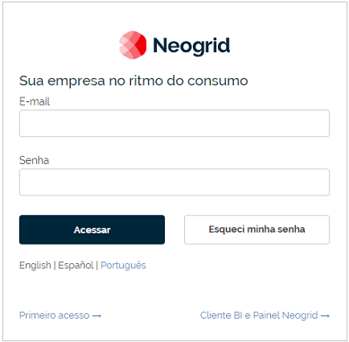
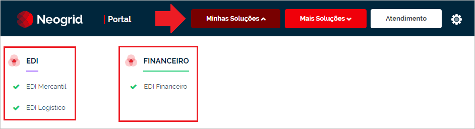
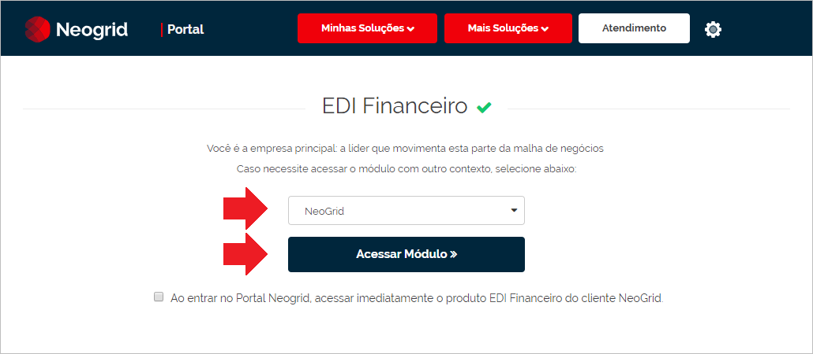
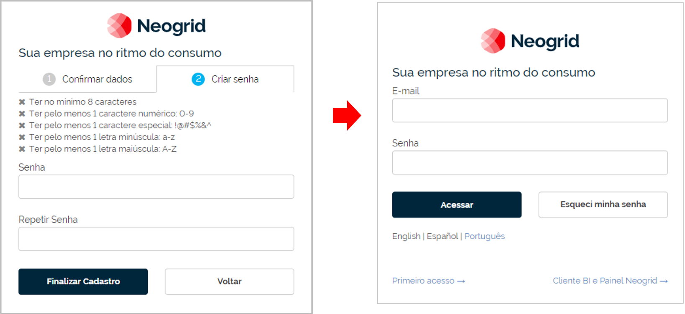
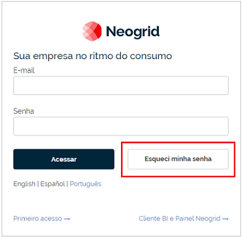
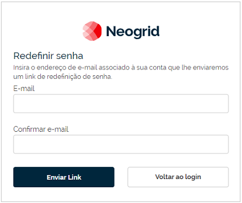
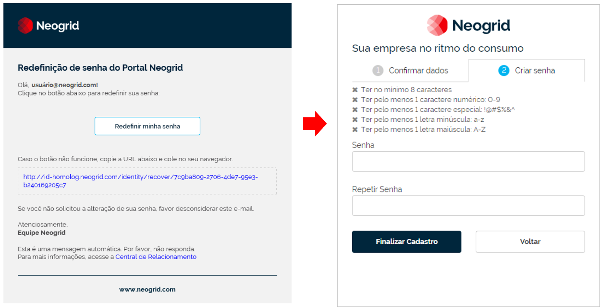

# Como Acessar o Sistema WebEDI  

O acesso ao WebEDI é realizado através dos módulos **EDI Financeiro**, **EDI Logístico** e **EDI Mercantil** que estão disponíveis para seleção no Portal Neogrid, de acordo com as configurações de acesso do usuário. Para realizar o acesso, siga as instruções abaixo:  

**Primeiro passo:** acesse o Portal Neogrid através do endereço https://portal.neogrid.com  

::: yellow
#### Atenção!
Caso não possua uma conta de acesso ao **Portal Neogrid**, siga as instruções do tópico [Como Criar a Conta de Acesso](#como-criar-a-conta-de-acesso).
:::  

**Segundo passo:** na tela de login, que é apresentada na sequência, informe seu e-mail e senha previamente configurados e clique sobre o botão **Acessar**. Caso não lembre da senha, acesse o tópico [Esqueci Minha Senha](#esqueci-minha-senha) para mais informações.  

  

**Terceiro passo:** na parte superior da página principal do Portal Neogrid, selecione o menu **Minhas Soluções** e clique sobre a opção do módulo que irá utilizar nas operações de compartilhamento com o parceiro de negócio.  

  

**Quarto passo:** nos campos e botões que são habilitados após a escolha da opção, selecione a empresa e clique sobre o botão **Acessar Módulo** para ingressar no sistema WebEDI.  

  

# Como Criar a Conta de Acesso  

O acesso ao **WebEDI** é realizado através do **Portal Neogrid**, onde estão disponíveis todos os produtos da Neogrid.  
Para acessar o Portal Neogrid, é necessário que o usuário tenha uma conta de acesso (**Neogrid ID**) para poder efetuar a identificação na tela de login, conforme imagem abaixo:  

  

As orientações para o cadastro da conta de acesso serão explicadas nos tópicos seguintes.  

## O que é Neogrid ID?  

O conceito de Neogrid ID é ser a identidade de um usuário da Neogrid (composta pelo endereço de e-mail e senha).  
A partir da conta Neogrid ID, o usuário estará credenciado para acessar o produto da Neogrid.  

## Efetuando o Processo de Cadastro  

Para cadastrar uma conta de acesso do Portal Neogrid, siga as instruções abaixo:  

**Primeiro passo:** entre em contato com o suporte da Neogrid para solicitar o cadastro da conta.  

**Segundo passo:** após o atendimento, será encaminhado ao seu e-mail uma mensagem com as instruções para ativar sua conta de acesso. Na mensagem, clique sobre o botão **Ativar Minha Conta** ou sobre o link disponível abaixo deste botão para abrir a página web da tela de cadastro de login do Portal Neogrid.  

  

**Terceiro passo:** na aba **Confirmar dados** da tela de cadastro de login, informe o e-mail, nome e sobrenome, e escolha o idioma do sistema. Leia os termos de uso e marque a caixa de seleção (_checkbox_) para aceitar os termos. Clique sobre o botão **Continuar** para prosseguir o cadastro na aba **Criar senha**.  

  

**Quarto passo:** na aba **Criar senha**, informar a senha que será utilizada para acesso do Portal Neogrid. Clique sobre o botão **Finalizar Cadastro** para concluir o registro da sua conta de acesso. Na sequência, será exibida a tela de login para efetuar o primeiro acesso ao Portal Neogrid.  

  

::: red
#### Importante!
**A senha deverá ter no mínimo oito caracteres e conter pelo menos:**
- Um caractere numérico de 0 até 9  
- Um caractere especial (Exemplo: !@#$%&^)  
- Uma letra minúscula  
- Uma letra maiúscula  
:::  

## Esqueci Minha Senha  

Ao acessar a tela de login do Neogrid ID e não for possível lembrar a senha ou houver necessidade de redefinir a senha de acesso, siga as instruções abaixo:  

**Primeiro passo:** na tela de login da página [Neogrid ID](https://id.Neogrid.com), clique sobre o botão **Esqueci minha senha**.  

  

**Segundo passo:** na tela de redefinição, que é apresentada na sequência, informe o endereço de e-mail associado à sua conta para que possa receber as orientações de alteração de senha. Após o preenchimento dos campos, clique sobre o botão **Enviar Link** para realizar o envio do e-mail.  

  

**Quarto passo:** na mensagem recebida em seu e-mail, clique sobre o botão **Redefinir minha senha** ou sobre o link disponível abaixo deste botão para abrir a página da tela de cadastro de nova senha no seu navegador. Na tela de cadastro, informe sua nova senha de acesso ao Portal Neogrid e clique sobre o botão **Confirmar nova senha** para concluir a redefinição com sucesso.  

  

::: red
#### Importante!
**A senha deverá ter no mínimo oito caracteres e conter pelo menos:**  
- Um caractere numérico de 0 até 9  
- Um caractere especial (Exemplo: !@#$%&^)  
- Uma letra minúscula  
- Uma letra maiúscula  
:::  
