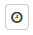

# Caixa de Entrada e Caixa de Saída  

_**Localização:** Menu Caixa de Entrada e Caixa de Saída_  
_**Módulos que as telas atendem:** EDI Mercantil, Logístico e Financeiro_  

**Caixa de Entrada**  
Nesta tela é possível acompanhar as mensagens recebidas dos seus parceiros de negócio.  

**Caixa de Saída**  
Nesta tela é possível confirmar os documentos enviados para seus parceiros de negócio.  

Ao acessar a Caixa de Entrada e/ou Caixa de Saída, é apresentada a página de pesquisa, oferecendo opções de filtros para localizar as mensagens recebidas ou enviadas e gerar a listagem com os resultados. Os filtros são divididos em duas abas: **Geral** e **Avançada**.  

## Aba Geral  

  

Os campos desta aba são:  
+ **Número:** identificação do documento. Pode ser o número de um pedido, de uma NF-e ou de uma cobrança, desde que integrados na aplicação WebEDI Neogrid.  
+ **Data de Criação Inicial/Final:** intervalo de datas que abrangem o dia da recepção/processamento do documento.  
+ **Hora de Criação Inicial/Final:** permite especificar o horário de recepção/processamento em conjunto com os filtros de Data de Criação.  

## Aba Avançada  

  

Os campos desta aba são:  
+ **Remetente:** Remetente do documento.  
+ **Destinatário:** Destinatário do documento.  
+ **Tipo:** Tipo do documento (Exemplo: Pedido, Nota Fiscal, NF-e...).  
+ **Leitura:** Situação do documento (Lido ou Não Lido).  
+ **Transferência:** Status de Transferência do documento (Exemplo: Disponível para download, transferido, entre outros.). A legenda dos Status pode ser consultada no botão **Legenda** conforme a próxima imagem.  
+ **Selecionar somente documentos com divergências/inconsistências:** Marque esta opção para que a consulta retorne apenas documentos com divergências ou inconsistências nos processos de batimento e validação.  

## Resultados da Pesquisa (Listagem)  

Após preencher os filtros desejados, clique no botão **Pesquisar** para que os documentos correspondentes sejam listados na tela principal. A partir de então, é possível navegar pelos documentos trafegados, selecionar documentos para realizar as operações da barra superior de botões e navegar pela pesquisa, caso haja mais de uma página de resultado.  

::: blue
#### Dica!
Após clicar em pesquisar, os filtros serão ocultados na tela. Para exibir novamente, basta clicar sobre o texto destacado em vermelho, conforme imagem abaixo:  

  
:::  

As informações dos documentos pesquisados são listadas nas seguintes colunas:  

  

+ **Caixas de Seleção:** Utilize os _checkbox_ situados na primeira coluna da lista de registros para selecionar os documentos a serem manipulados.  
+ **Remetente:** Nome do remetente do documento, razão social da empresa. Clique sobre este nome para verificar os detalhes do remetente do documento.  
+ **Destinatário:** Nome do destinatário do documento, razão social da empresa. Clique sobre este nome para verificar os detalhes do destinatário do documento.  
+ **Número:** Número identificador do documento. Clique sobre este número para abrir o arquivo do documento.  
+ **Tipo:** Tipo do documento (Exemplo: Pedido, Instrução de Transporte, Pagamento de Tributos).  
+ **Data Criação:** Data em que o documento foi recebido e processado no WebEDI.  
+ **Leitura:** Indica se o destinatário já realizou a leitura do documento. A Leitura pode ser realizada via portal (manualmente) ou através de conectividade (automaticamente).  
+ **Transferência:** Indica a situação de transferência do documento no WebEDI. Em caso de dúvidas, clique no botão **Legenda** disponível na parte inferior da listagem de documentos pesquisados.  

Os botões da parte superior da tela da listagem fornecem as seguintes operações:  

  

+ **Salvar:** Realiza o download dos documentos selecionados para serem importados no seu sistema (apenas Caixa de Entrada).  
+ **Excluir:** Exclui os documentos selecionados da Caixa de Entrada ou Caixa de Saída. Obs.: o documento não será excluído para o seu parceiro de negócio.  
+ **Imprimir:** Gera versão dos documentos selecionados para impressão.  
+ **Exportar Resultado:** Exporta os resultados pesquisados na Caixa de Entrada ou Caixa de Saída no formato de Excel.  

Os botões localizados após a coluna **Transferência** fornecem os seguintes recursos:  

|                    Ícone                     | Descrição                                                                                         |
|:--------------------------------------------:|---------------------------------------------------------------------------------------------|
|           | Exibe a visualização web do documento                                                            |
|   | Realiza o download do documento para ser importado em seu sistema (apenas Caixa de Entrada)   |
|  | Exibe o histórico de status de transferência do documento                                    |
|   | Exibe os documentos relacionados ao documento listado                                       |
|  | Exibe as divergências encontradas em um processo de validação                                 |
|             | Exporta o documento no formato PDF                                                             |  
