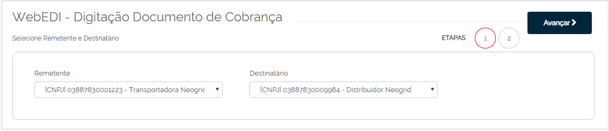
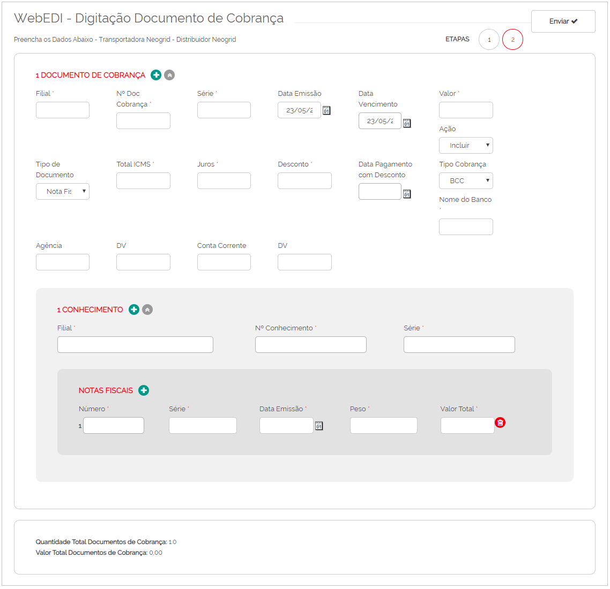

# Digitação de Documento de Cobrança  

_**Localização:** Menu WebEDI, Submenu Digitação de Documento de Cobrança._  
_**Módulos que esta tela atende:** EDI Logístico, desde que o usuário possua permissão para envio de documentos de cobrança._  

Esta tela possibilita digitar documentos de cobrança para seus parceiros de negócio.  

Na primeira etapa, selecione o remetente e o destinatário, e clique em **Avançar**.  

  

Na segunda etapa, digite as informações com base no seu documento de cobrança:  

  

É possível encaminhar mais de um documento de cobrança em um mesmo arquivo. Para isso, clique no botão **Documento de Cobrança**.  
Para vincular mais de um conhecimento de transporte, clique em **Conhecimento**.  
Para vincular mais de uma nota fiscal, clique em **Notas Fiscais**.  
Confirme os dados digitados e clique em **Enviar**.  
