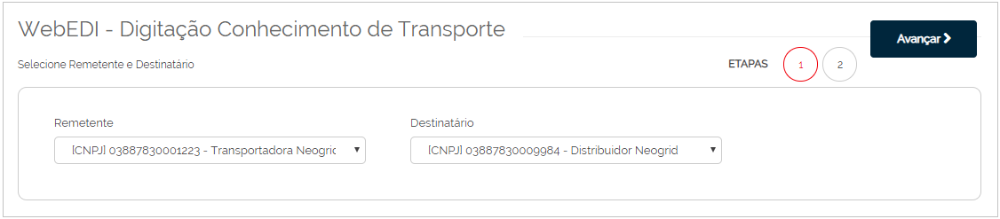
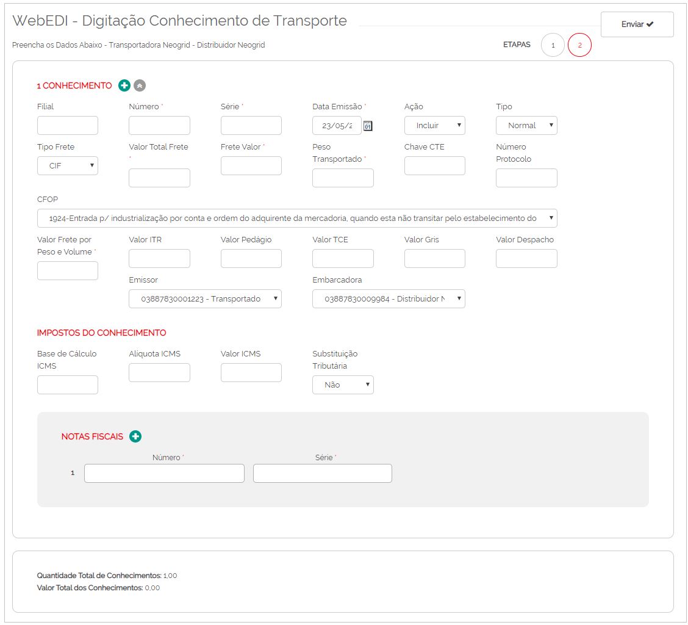

# Digitação de Conhecimento de Transporte  

_**Localização:** Menu WebEDI, Submenu Digitação de Conhecimento de Transporte_  
_**Módulos que esta tela atende:** EDI Logístico, desde que o usuário possua permissão para envio de conhecimento de transporte._  

Esta tela possibilita digitar o conhecimento de transporte para seus parceiros de negócio.  

**Primeiro passo:** selecione o remetente e o destinatário, e clique em **Avançar**.  

  

**Segundo passo:** digite os dados de conhecimento de transporte.  
  
  

Para incluir mais de um conhecimento de transporte, clique em **Conhecimento +**.  
Para adicionar mais notas fiscais dentro do conhecimento de transporte, clique em **Notas Fiscais +**.  
Após inserir todas as informações, clique em **Avançar**.  
