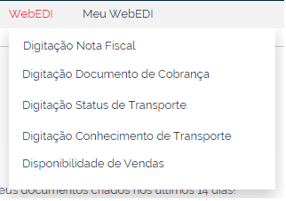

# Digitação de Documentos  

O menu **WebEDI** disponibiliza as funcionalidades que permitem realizar a digitação de documentos que serão enviados ao parceiro de negócio (destinatário).  
Exemplo: digitação da nota fiscal referente determinado pedido.  

Navegue no menu ao lado para acessar o conteúdo explicativo de cada opção.  
