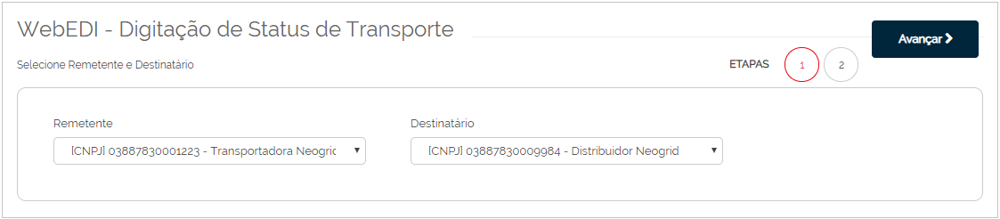
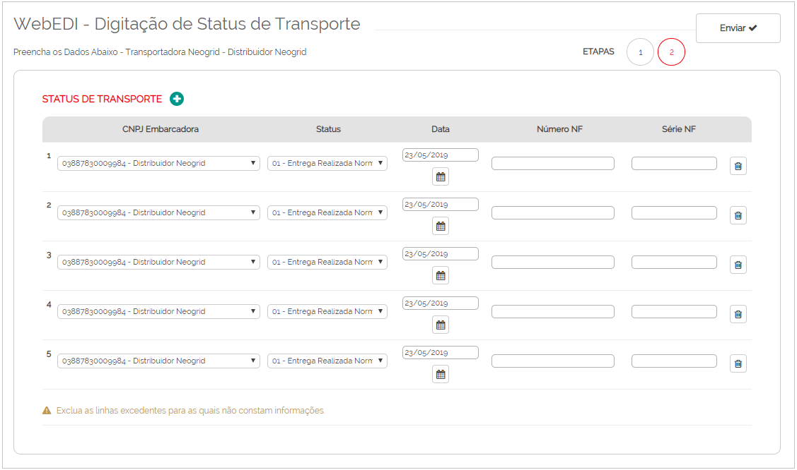

# Digitação de Status de Transporte  

_**Localização:** Menu WebEDI, Submenu Digitação de Status de Transporte_  
_**Módulos que esta tela atende:** EDI Logístico, desde que o usuário possua permissão para envio de status de transporte._  

Esta tela possibilita digitar o _status_ de transporte para seus parceiros de negócio.  

**Primeiro passo:** selecione o remetente e o destinatário, e clique em **Avançar**.  

  

**Segundo passo:** digite os dados do _status_ de transporte.  

  

Por padrão, são apresentados cinco registros na tela para efetuar a digitação.  
Para adicionar mais registros de _status_ de transporte, clique em **Status de Transporte +**.  
Para remover um registro de _status_ de transporte, clique no botão **Lixeira**.  
Remova os registros não utilizados.  
Após inserir todas as informações, clique em **Enviar**.  
