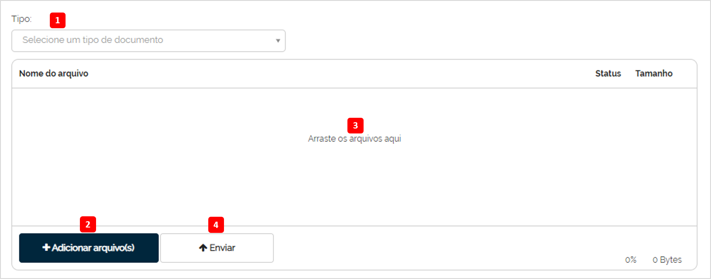
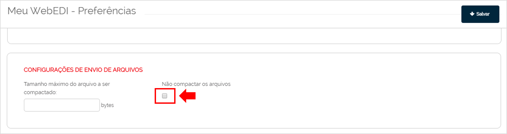

# Envio de Arquivos  

_**Localização:** Menu WebEDI, Submenu Envio de Arquivos_  
_**Módulos que esta tela atende:** EDI Mercantil, Logístico e Financeiro desde que o usuário possua permissão para envio de arquivos._  

**Objetivo:** Através desta tela é possível enviar múltiplos documentos para seus parceiros de negócio.  

neo-set-red **Realizando o Envio de Arquivos:** neo-end-red  

  

| Referência da Imagem | Nome do Recurso | Descrição | 
|-|-|-|
| 1 | **Campo Tipo:** | Permite selecionar as opções do tipo de documento a ser enviado. |  
| 2 | **Botão Adicionar arquivo(s):** | Apresenta tela para localizar os arquivos salvos em seu computador e adicioná-los na área da listagem de documentos **neo-set-red (3) neo-end-red**. Também é possível clicar sobre os arquivos da tela do seu computador e arrastá-los até a área da listagem.  |  
| 3 | **Listagem dos Arquivos Selecionados** | Esta área exibe a listagem dos arquivos selecionados para realizar o envio. As colunas da listagem exibem o **Nome do arquivo**, o **Status** (percentual de processamento) e o **Tamanho** do arquivo. | 
| 4 | **Botão Enviar** | Realiza o envio dos documentos. | 

::: red
#### Importante!
1. No campo **Tipo**, só serão apresentadas as opções em que o usuário possui permissão para envio.  

2. Após clicar sobre o botão **Enviar**, realize a confirmação da integração do documento após alguns segundos no menu **Caixa de Saída**.  

3. Os arquivos adicionados serão compactados automaticamente. Caso queira desabilitar a compressão dos arquivos, vá no menu **Meu WebEDI**, submenu **Preferências** e selecione o _checkbox_ da opção **Não compactar os arquivos** da seção **Configurações de Envio de Arquivos**.  
:::  

  
