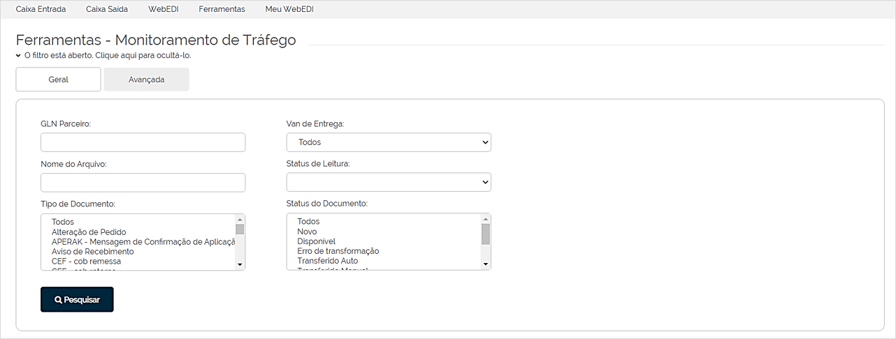

# Monitoramento de Tráfego  

_**Localização:** Menu Ferramentas, Submenu Monitoramento de Tráfego_  
_**Módulos que esta tela atende:** EDI Mercantil, Logístico e Financeiro._  

Para acompanhar a situação de documentos enviados e recebidos no EDI, a tela de **Monitoramento de Tráfego** fornece o relatório com visões detalhada e [consolidada das informações](#relatório-consolidado) para o acompanhamento do tráfego conforme filtros informados na consulta.  

Vamos começar?  

## Relatório Detalhado

### Filtros

Os filtros de pesquisa são fornecidos em duas abas: Geral e Avançada.  

**Aba Geral**  

  

Nesta aba, podemos filtrar os documentos pela **Razão Social** e **CNPJ do Parceiro** (ou considerar todos os CNPJ desta empresa), **Número do Documento**, **Datas Inicial e Final** (período do tráfego) e, por fim, temos o campo **Tipo de Pesquisa** em que determinamos como queremos a visão do relatório: **Detalhado** ou **Consolidado**.  
Para este tópico, usaremos o tipo **Detalhado**.    

Caso esses filtros não sejam suficientes, temos a aba de filtros avançados, explicada na sequência.  

**Aba Avançada**  

  

Nesta aba, podemos filtrar os documentos pelo número do **GLN do Parceiro**, a **Van de Entrega** do documento, **Nome do Arquivo**, **Status de Leitura** (documentos lidos ou não pelo parceiro), **Tipo e Status de Documento**.  

### Relatório com resultados da pesquisa  

  

As colunas do relatório gerado em tela após a consulta, exibem as seguintes informações: **Código** do documento, razão social do **Remetente** e **Destinatário**, descrição do **Tipo** e do **Assunto** do documento, a **Data** em que ocorreu o tráfego e o **Status** do documento.  

As colunas seguintes, fornecem as seguintes ações:  

+ **Histórico de Eventos (W)**: esta tela apresenta o histórico de todos os eventos em que o documento passou, onde podemos visualizar os dados de data/hora, tipo do evento, nome do arquivo, CNPJ do remetente e destinatário e a observação (exibida em nova linha após clicar sobre o ícone **Lupa**).   
  

+ **Histórico de Transferência (HT):** esta tela apresenta o histórico de transferências do documento, onde podemos visualizar os dados de data, status e observação.  
  

+ **Divergência (D):** exibe o símbolo indicando se o documento possui divergência.  

+ **Status de Leitura (LD):** exibe o símbolo indicando se o documento foi lido pelo parceiro de negócio.  

+ **Visibilidade para Remetente (VR):** exibe o símbolo indicando se o documento é visível para o remetente.  

+ **Visibilidade para Destinatário (VD):** exibe o símbolo indicando se o documento é visível para o destinatário.  

Outras ações habilitadas junto com o relatório são:  

+ **Exportar Resultado:** permite gerar um arquivo Excel com a listagem do relatório.  

+ **Redisponibilizar:** permite que os arquivos selecionados no relatório, sejam disponibilizados novamente no EDI.  

## Relatório Consolidado

Para acessar o relatório com a visão consolidada das informações, selecione a opção **Consolidado** no filtro **Tipo de Pesquisa** da aba **Geral**.  

Ao clicar em **Pesquisar**, o seguinte relatório é apresentado:  

As colunas exibem as seguintes informações:  

+ **Documentos recebidos:** exibe a descrição do tipo do documento recebido.  

+ **Quantidade:** exibe a quantidade recebida do tipo do documento.  

+ **Último trafegado:** exibe a data e a hora do último tráfego desse documento.  

