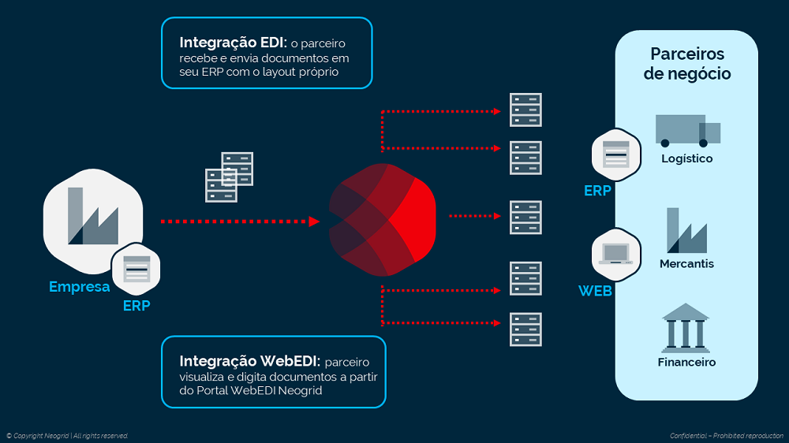

# Introdução  

O **WebEDI** é um sistema web que permite aos fornecedores, clientes e parceiros de negócios compartilharem informações de forma consolidada e transparente.
Veja a seguir como funciona o fluxo macro do WebEDI:  

  

1. Entre os parceiros de negócio movimentam-se documentos de diferentes formatos, pois as empresas podem trabalhar com diferentes sistemas de gestão;  

2. A Neogrid se responsabiliza por trafegar estas informações, realizando a tradução necessária do formato do arquivo enviado pela empresa emissora, de modo que o mesmo possa ser importado com sucesso no sistema da empresa receptora. Desta forma, a Neogrid garante transparência neste processo para os dois pontos da cadeia;  

3. Existem empresas, entretanto, que não possuem sistemas de gestão implantados. Para estes casos, a Neogrid disponibiliza o sistema WebEDI, no qual a empresa pode visualizar ou até mesmo imprimir estes documentos recebidos de seus parceiros. Além disso, é possível efetuar a digitação de documentos;  

4. Por sua vez, as empresas que possuem algum sistema de gestão, poderão receber e enviar documentos com o seu próprio layout.  

neo-set-red **Benefícios do WebEDI** neo-end-red  

+ Padronização da comunicação com os parceiros utilizando apenas um meio de comunicação  

+ Redução do tempo gasto com tarefas operacionais  

+ Redução de custos de impressão e aquisição de papel  

+ Maior agilidade no processo (desburocratização)  

+ Eliminação de digitação de documentos na recepção de mercadorias  

+ Viabiliza a redução dos níveis de estoque devido a diminuição de erros  

+ Não há investimento em Infraestrutura  

+ Melhor relacionamento com o seu parceiro de negócio  

+ Escalabilidade para atender diferentes processos de negócios  

::: blue
#### AVISO LEGAL
Esta documentação é propriedade da Neogrid. Trata-se de documento confidencial e não está sujeita à reprodução total ou parcial, processamento ou transmissão de computador, de qualquer forma ou por qualquer meio: eletrônico, mecânico, fotocópia, gravação ou de outra forma.  
Da mesma forma, pode não estar sujeito a empréstimo, aluguel ou qualquer forma de cessão de uso sem o prévio consentimento por escrito da Neogrid, sendo proprietária dos direitos autorais. O não cumprimento das limitações mencionadas, por qualquer pessoa que tenha acesso à documentação, estará sujeito às penalidades previstas na Lei.  
:::  
