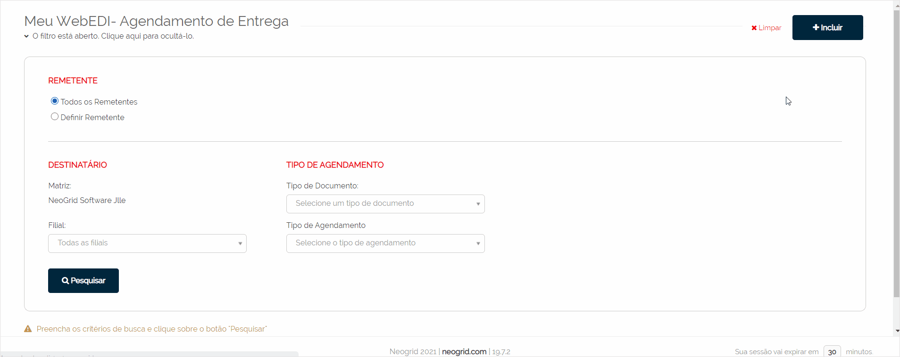
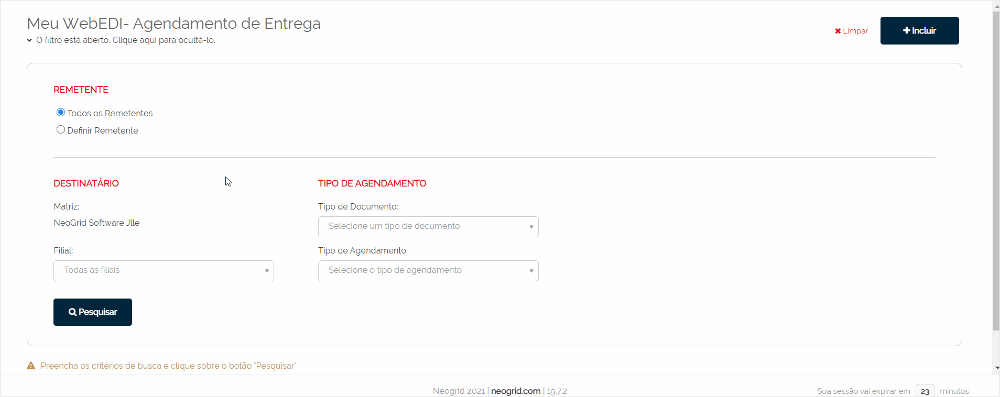
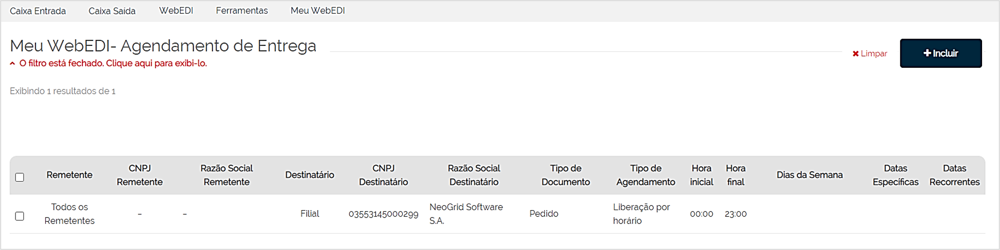

# Agendamento de Entrega  

_**Localização:** Menu Meu WebEDI, Submenu Agendamento de Entrega_  
_**Módulos que esta tela atende:** EDI Mercantil, Logístico e Financeiro._  

O agendamento permite determinar que a entrega de documentos seja liberada ou bloqueada em horários e datas específicas.  
O objetivo desta funcionalidade é atender as empresas que possuem horários de corte para faturamento ou restrições para recebimentos de documentos em dias não úteis.  

Podem ser configuradas as seguintes opções de períodos:  
+ **Horários** 
+ **Dias da semana**   
+ **Datas recorrentes**   
+ **Dias específicos**   

A configuração de agendamento de entrega pode ser realizada para cada relacionamento envolvendo:  
+ **Empresa Remetente (Localização ou Organização)**  
+ **Empresa Destinatária (Localização ou Organização)**  
+ **Tipo de Documento**  

::: red
#### Importante!
Esta funcionalidade está disponível apenas para documentos sincronizados através da conectividade Client NeoGrid.  
:::  

::: blue
#### Dica!
Este documento contém vídeos demonstrativos relativos ao tópico explicado.  
:::  

## Criando Agendamentos de Entrega  

Para criar um agendamento de entrega, clique sobre o botão **Incluir** localizado na tela **Meu WebEDI - Agendamento de Entrega** (menu Meu WebEDI, submenu Agendamento de Entrega).  

Nesta tela, crie o agendamento realizando as seguintes configurações:  
+ **Remetente:** neste campo, a opção **"Todos os Remetentes"** já vem selecionada por padrão, mas é possível selecionar a opção **"Definir remetente"** para configurar um remetente específico. Ao escolher esta segunda opção, mais dois campos serão habilitados para informar a matriz e a filial.  
+ **Destinatário:** informe uma ou mais filiais como destinatárias do documento que está sendo agendado.  
+ **Tipo de Agendamento:** selecione o tipo de documento e o tipo de agendamento (Liberação por Horário ou Bloqueio por Data).  
  - **Liberação por Horário:** essa opção habilita os campos que permitem determinar o horário em que a sincronização poderá ser realizada e efetuar a entrega do documento ao destinatário. Exemplo: determinado documento poderá ser entregue somente no intervalo das 08:00 às 19:00.   
  - **Bloqueio por Data:** ao escolher essa opção, são habilitados os campos que permitem bloquear a entrega dos documentos em determinados períodos. Você poderá configurar o bloqueio por:  
    - **Dia da semana** (Exemplo: sábado e domingo)  
    - **Datas específicas**  
    - **Datas recorrentes** (Exemplo: feriados)   

**Exemplo da criação do agendamento:**  

## Pesquisando Agendamentos Criados  

Para consultar os agendamentos existentes, informe os filtros desejados e clique sobre **Pesquisar**.  

Você poderá pesquisar por remetente específico ou por todos, por destinatário, tipo de documento e de agendamento.

Na sequência, é exibido o relatório com os resultados encontrados conforme a pesquisa realizada.  
As colunas exibem os dados do remetente e do destinatário, o tipo do documento e de agendamento, hora inicial e final (caso seja "Liberação por Horário"), dias da semana, datas específicas e recorrentes (caso seja "Bloqueio por Data").     

