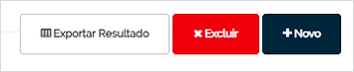

# Avisos por E-mail  

_**Localização:** Menu Meu WebEDI, Submenu Avisos por E-mail_  
_**Módulos que esta tela atende:** EDI Mercantil, Logístico e Financeiro._  

Esta tela permite criar regras para a geração de avisos por e-mail, quando houver envio ou recebimento de determinados tipos de documentos com seus parceiros de negócio.  

Na tela principal, é possível pesquisar as regras cadastradas para a sua organização. A pesquisa pode ser realizada por razão social do parceiro, e-mail do destinatário da regra ou tipo de documento.  

  

Após clicar no botão **Pesquisar**, é apresentada a listagem das configurações conforme filtros informados. Os dados exibidos são: e-mail com regra de aviso configurada, descrição do sentido do documento (enviar, receber ou os dois), descrição do tipo de documento, dados da organização e localização consideradas no "De/Para". A coluna **Status** disponibiliza o botão que permite ativar/desativar a regra para a organização e localização. O botão com ícone **Lupa**, permite editar as informações da configuração.  

  

Após a geração da listagem, são habilitadas as seguintes opções de operações na parte superior da tela: exportação da listagem em planilha, exclusão das regras de e-mail e cadastro de novas regras de avisos por e-mail.  

  

Para incluir novas regras, clique em **Novo**. Na sequência, é apresentada a tela que permite configurar as regras de avisos por e-mail:  

  

Nesta tela, são oferecidas as seguintes opções para configuração:  

+ **Válido para:** selecione uma filial ou marque o _checkbox_ "Todas as minhas filiais".  

+ **Mandar e-mail para:** selecione o destinatário do e-mail.  

+ **Quando:** permite especificar o sentido do documento em relação ao usuário que cria a regra (enviar, receber ou ambos).  

+ **Documentos:** permite especificar tipos de documentos.  

+ **Organizações e Filiais Parceiras:** permite especificar os parceiros de negócio. A configuração pode ser para todos, organizações ou filiais.  

Após preencher os dados, clique em **Salvar**.  
