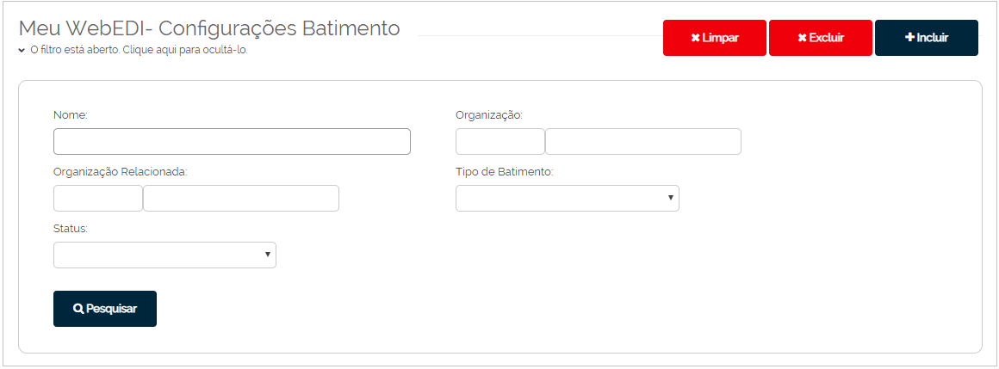
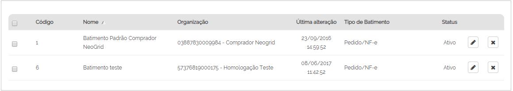
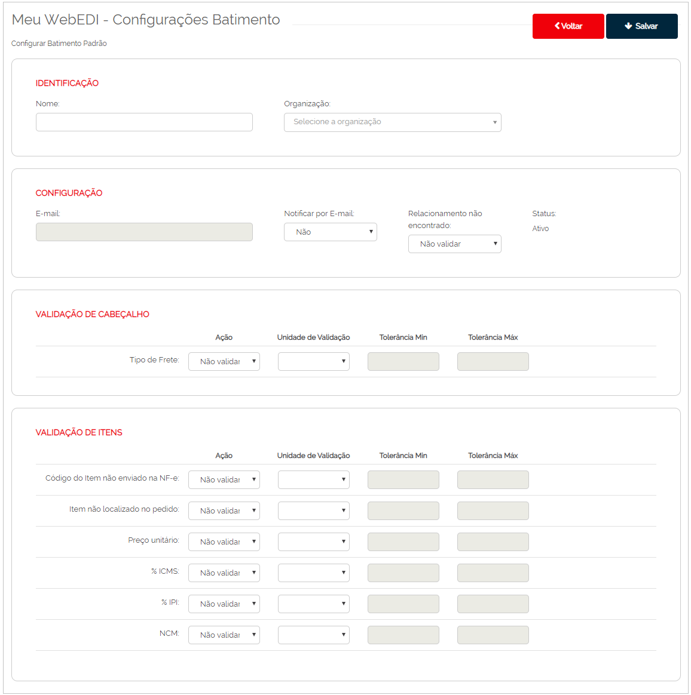
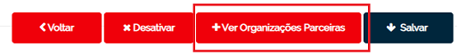
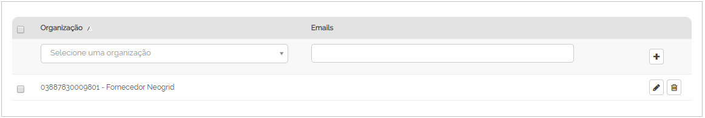
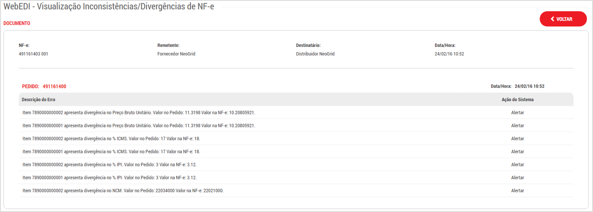

# Configurações Batimento

_**Localização**: Menu Meu WebEDI, Submenu Configurações Batimento_  
_**Módulos que esta tela atende**: EDI Mercantil, mediante contratação._  

O batimento de documentos é o confronto de um documento com outro documento enviado anteriormente.
Exemplo: Nota Fiscal com um Pedido de Compra, Status de Transporte com uma Instrução de Transporte.  

Nesta tela é possível configurar diversas regras de batimento e associar os respectivos parceiros de negócio às regras. Cada parceiro pode ser associado a uma regra de batimento.  

::: red
#### Atenção!

Para que estas configurações sejam aplicadas é necessário possuir o fluxo configurado para recebimento de documentos do Neogrid Fiscal.

:::  

A tela principal permite realizar a pesquisa das regras de batimento por intermédio dos seguintes filtros:  
+ **Nome**: nome da regra de batimento.  
+ **Organização Relacionada**: seu parceiro de negócio.  
+ **Tipo de Batimento**: tipos de documentos envolvidos no batimento.  
+ **Status**: Ativo ou Inativo.  

A listagem apresenta os valores conforme filtros informados:

Para criar uma regra de batimento, clique em **Incluir** para apresentar a tela **Configurações Batimento**.  

  

Esta tela apresenta as seguintes seções de configuração para preenchimento das regras:  
+ **Identificação:** permite informar o nome da regra de batimento e a organização.  
+ **Configuração:** permite que o usuário informe seu e-mail, caso queira receber uma notificação por este recurso.  
+ **Validação de Cabeçalho:** ação realizada ao documento caso não encontre o seu documento relacionado para a realização do batimento.  
+ **Validação de Itens:** validações pertinentes aos campos dos documentos.  
  

**Cadastro de Parceiros**  

Para adicionar os seus parceiros de negócio, selecione um registro na tela de listagem e clique sobre o botão **Edição** . Na tela seguinte, clique sobre **+ Ver organizações parceiras**.  

Pesquise no campo **Organização** pelo CNPJ ou Razão Social e insira o e-mail caso queira notificá-lo do batimento.  
Na sequência, clique no símbolo de adição "+" para acrescentar seu Parceiro de Negócio a regra de batimento.

As divergências de batimento ficam disponíveis na listagem dos documentos nas telas de **Caixa de Entrada** / **Caixa de Saída** no botão **Divergência**.  

