# Cadastro de Produtos  

_**Localização:** Menu Meu WebEDI, Submenu Cadastro de Produtos_  
_**Módulos que esta tela atende:** EDI Mercantil_  

Esta tela permite adicionar os produtos para a realização de testes, validações ou de/paras.  

::: red
#### Importante!
A simples inclusão dos produtos não garante a realização dos testes. Para mais informações, entre em contato com a Neogrid.
:::  

Ao acessar o menu **Meu WebEDI > Cadastro de Produtos**, é apresentada a tela **Cadastro de Produtos** disponibilizando os seguintes recursos:  

1. Botões **Importar** e **Incluir** neo-set-red **(1)** neo-end-red: permitem, respectivamente, importar uma planilha de produtos ou informá-los manualmente na base de dados do WebEDI. Mais informações sobre estes recursos podem ser vistas ainda neste tópico (**Cadastro de Produtos**).  

2. Seção de pesquisa de produtos já cadastrados neo-set-red **(2)** neo-end-red. Mais informações deste recurso podem ser vistas no tópico **Pesquisa de Produtos**.  
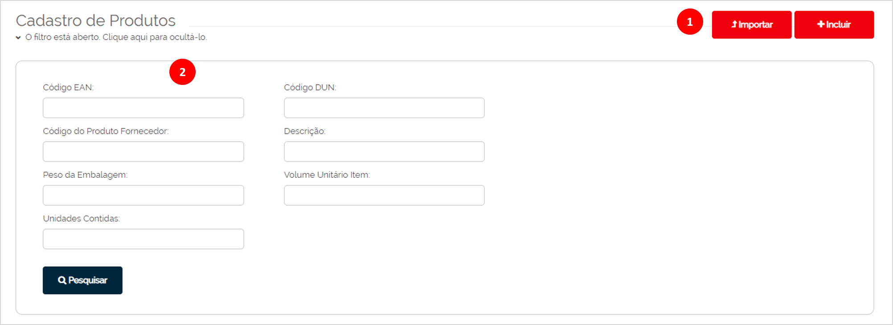  

## Botão Importar  

  

Apresenta a tela que permite efetuar a importação do arquivo que contém os dados dos produtos para a base do sistema WebEDI.  

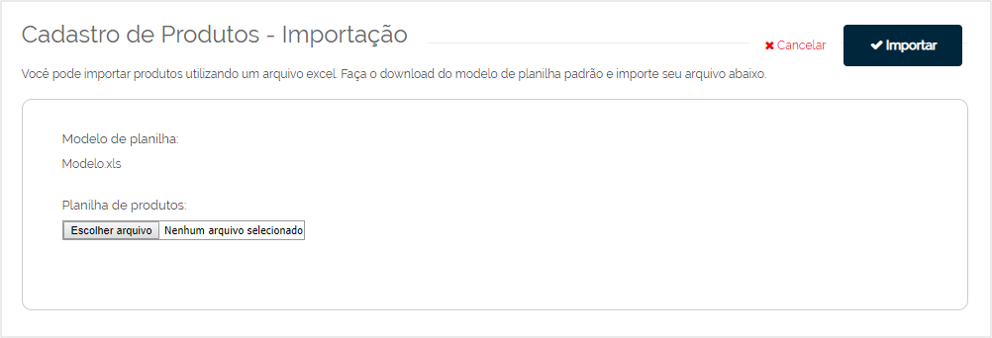  

::: red
#### Atenção!
Somente o modelo de arquivo do WebEDI será aceito para efetuar a importação.
Este modelo deve ser baixado clicando sobre o link **Modelo.xls** localizado abaixo da descrição **Modelo de planilha**.
:::  

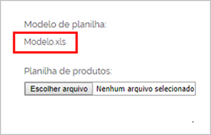  

Este arquivo já possui uma tabela padrão para preenchimento, não sendo necessário criar outra.  

Ao concluir o preenchimento dos dados nesta tabela, acesse a tela de importação de produtos, clique sobre o botão **Escolher arquivo** e selecione o arquivo que está salvo em seu computador ou local de rede.  

Na sequência, ainda na tela de importação, clique sobre o botão **Importar** para gerar a importação dos dados.  

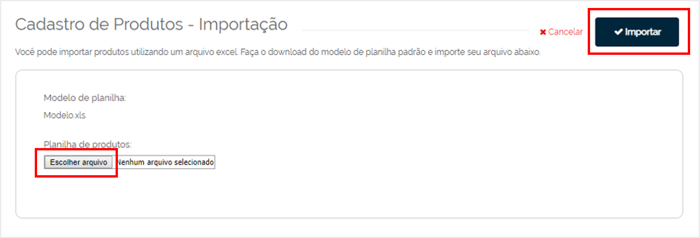  

## Botão Incluir  

  

Apresenta a tela **Incluir Lista de Produtos** que permite cadastrar e incluir manualmente os produtos para a base de dados do sistema WebEDI. Esta tela possui duas seções: Dados do Produto e Lista de Produtos a Serem Adicionados.  

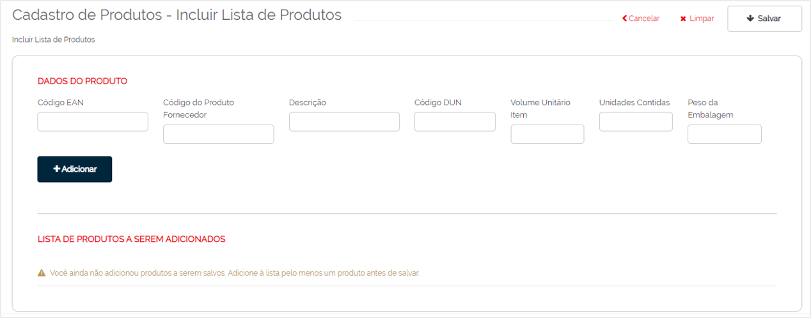  

### Seção Dados do Produto

Nesta seção da tela, poderão ser cadastrados quantos produtos forem necessários para a base de dados do WebEDI.  

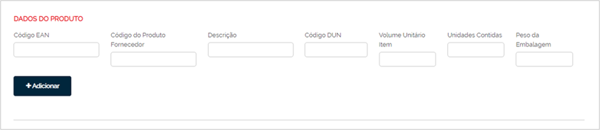  

Campos da tela:  

+ **Código EAN**: informe o código de barras EAN do produto.  

+ **Código do Produto Fornecedor** e **Descrição**: informe nestes campos o código e a descrição do produto do fornecedor.  

+ **Código DUN**: informe o código de barras DUN do produto.  

+ **Código do Produto Fornecedor** e **Descrição**: informe nestes campos o código e a descrição do produto do fornecedor.  

+ **Volume Unitário Item**: informe o volume unitário do produto.  

+ **Unidades Contidas**: informe a quantidade de unidades do produto contida numa embalagem com código de barras DUN.  

+ **Peso da Embalagem**: informe o peso da embalagem do produto.  

Ao concluir o cadastro das informações do produto, clique sobre o botão **Adicionar** para incluir o registro deste produto na lista temporária de itens que aguardam para serem adicionados na base.  

### Seção Lista de Produtos a Serem Adicionados  

Esta listagem apresenta os produtos cadastrados na seção **Dados do Produto** para que o usuário possa conferir e efetuar alterações, caso necessário, antes de salvar definitivamente no sistema WebEDI.  

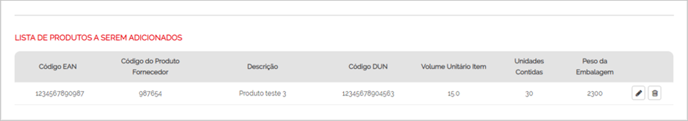  

Os botões localizados após a coluna **Peso da Embalagem** fornecem as seguintes operações:  

+  **Editar:** exibe os dados do item nos campos da seção **Dados do Produto** para a alteração das informações.  

+ 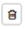 **Excluir:** remove os dados do produto da listagem.  

::: blue
#### Dica!
Após a alteração, clique sobre o botão **Adicionar** da [**Seção Dados do Produto**](#seção-dados-do-produto). Esta ação permite que o item retorne a tela de listagem com os dados modificados.
:::  

Após adicionar todos os produtos, clique sobre o botão **Salvar** para gravar os itens na base de dados do sistema WebEDI. Caso a tela seja encerrada pelo usuário ou pelo sistema sem que este botão seja acionado, os dados dos produtos incluídos na lista não serão salvos.  

::: red
#### Importante!
Caso os fornecedores não informem as descrições dos produtos nos documentos enviados ao WebEDI, elas não serão exibidas nas consultas.
Como solução para as próximas remessas de produtos sem nome, o usuário poderá cadastrar as descrições não fornecidas na seção **Dados do Produto** para que sejam vinculadas aos itens da próxima remessa quando estes estiverem sem descrição.
A associação entre a descrição cadastrada no WebEDI e o produto sem descrição no documento só ocorrerá quando o arquivo é recebido no sistema e não após esta etapa. Caso o arquivo sem descrições de produtos já esteja salvo no sistema WebEDI, mesmo que o usuário efetue posteriormente o cadastro das descrições faltantes, o vínculo não será realizado neste arquivo. Esta associação ocorrerá somente nos próximos documentos enviados ao sistema.  
:::  

# Pesquisa de Produtos  

Ao acessar o submenu **Cadastro de Produtos**, é apresentada a seção de pesquisa com grupo de campos que permitem filtrar a busca dos produtos já cadastrados na base do WebEDI.  

Filtre a pesquisa conforme instruções abaixo:  

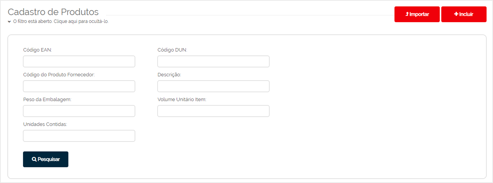  

+ **Código EAN:** informe o código de barras EAN do produto.  

+ **Código DUN:** informe o código de barras DUN do conjunto de unidades individuais do produto.  

::: blue
#### Conceito
Código EAN é um código único de 13 dígitos do produto que permite ao varejista comercializar as unidades individuais do produto para o consumidor final no ponto de venda (PDV). Exemplo: uma embalagem de 1 litro de achocolatado.  
Código DUN, em inglês "Distribution Unit Number", é o código de barras de 14 dígitos utilizado para identificar um conjunto de unidades individuais de um produto, ou seja, o código DUN contém um conjunto de itens com códigos EAN. Exemplo: uma embalagem de achocolatado, que é vendida ao consumidor final, contém um código EAN. Porém, esse produto é vendido ao mercado em caixa com 12 achocolatados. Essa caixa irá carregar o código DUN para identificar as 12 unidades e seus respectivos EAN.
:::  

+ **Código do Produto Fornecedor** e **Descrição:** informe nestes campos o código e a descrição do produto do fornecedor.  

+ **Peso da Embalagem:** informe o peso da embalagem.  

+ **Volume Unitário Item:** informe o volume unitário do produto.  

+ **Campo Unidades Contidas:** informe a quantidade de unidades do produto contida numa embalagem com código de barras DUN como filtro para a pesquisa. Exemplo: se o achocolatado é vendido ao mercado em caixa com 12 unidades desse produto, informar a quantidade "12" neste campo.  

Após o preenchimento dos campos, clique sobre o botão **Pesquisar** para executar a busca dos produtos já cadastrados. Na sequência, a tela de pesquisa é recolhida (ocultada) e é apresentado o resultado da pesquisa conforme descrito no tópico seguinte.  

::: blue
#### Dica!
Para exibir a tela de pesquisa novamente, clique sobre o link do texto explicativo na cor vermelha, localizado acima do resultado.  

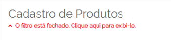
:::  

## Resultado da Pesquisa (Listagem)  

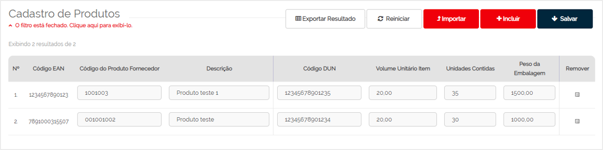  

+ As colunas de resultado apresentam as informações dos produtos como, por exemplo, código EAN, código do produto fornecedor, entre outros.  

+ Os campos a partir da coluna **Código do Produto Fornecedor** permitem realizar alterações das informações, caso seja necessário.  

+ A coluna **Remover** permite selecionar os itens que serão excluídos ao clicar sobre o botão **Salvar**.  

Os botões localizados na parte superior da listagem ao lado dos botões já mencionados anteriormente (Importar e Incluir), permitem realizar as seguintes operações:  

+ **Exportar Resultado:** permite salvar o relatório da listagem no formato Excel no seu computador ou local de rede.  

+ **Reiniciar:** permite que os campos exibam a informação que estava registrada antes da alteração efetuada. Exemplo: caso tenha alterado várias descrições de produtos, mas percebeu alguns erros de digitação e precisa retornar as informações originais de cada um. Este botão possibilita retornar as informações originais de todos os campos que foram alterados.  

+ **Salvar:** grava as alterações realizadas nos campos dos produtos e realiza o processo de exclusão dos itens selecionados na coluna **Remover**.  

::: yellow
#### Atenção!
O recurso **Reiniciar** poderá ser utilizado para as alterações que ainda não estiverem gravadas pelo botão **Salvar**.
:::  
