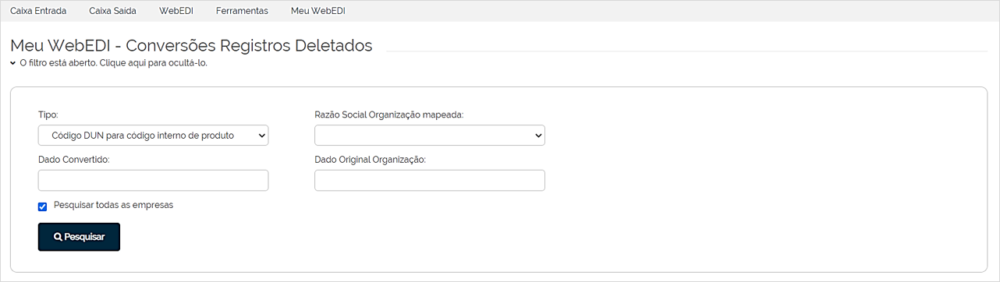
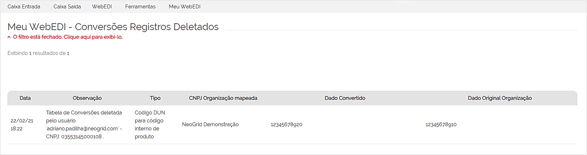

# Registros de Conversões Deletados  

_**Localização:** Menu Meu WebEDI, Submenu Conversões Registros Deletados_  
_**Módulos que esta tela atende**: EDI Mercantil, Logístico e Financeiro._  

Esta tela permite consultar os registros excluídos da tabela de conversão. É possível pesquisar também pelos códigos excluídos.  

A pesquisa pode ser realizada pelo **Tipo** da Conversão, **Razão Social da Organização Mapeada** (parceiro de negócio), **Dado Convertido** ou **Dado Original da Organização**.    
Preencha os critérios de busca e clique em **Pesquisar**.  

  

Na listagem apresentada após a pesquisa, são exibidas as informações: **Data**, **Observação**, **Tipo** da tabela de conversão, **CNPJ da Organização Mapeada** (parceiro de negócio), **Dado Convertido** e **Dado Original da Organização**.  

  
