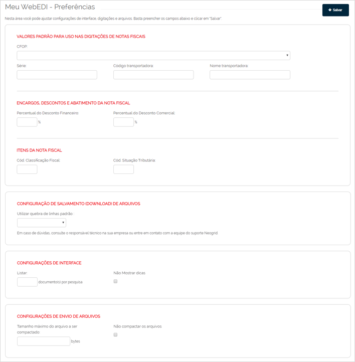

# Configurar Preferências do WebEDI  

_**Localização:** Menu Meu WebEDI, Submenu Preferências_  
_**Módulos que esta tela atende:** EDI Mercantil, Logístico e Financeiro._  

Permite especificar preferências para diversas funcionalidades do sistema WebEDI.  

  

As opções de preferências são:  

+ **Valores padrão para Digitação de Nota Fiscal:** permitir especificar valores padrões para os campos de Série da Nota Fiscal, CFOP, Código da Transportadora e Nome da Transportadora.  

+ **Encargos, Descontos e Abatimentos da Nota Fiscal:** permite especificar os percentuais de descontos financeiros e comerciais.  

+ **Itens da Nota Fiscal:** permite especificar o código da classificação fiscal e da situação tributária dos itens da nota fiscal.  

+ **Configuração de Salvamento (Download de Arquivos):** especifica o padrão de quebra de linha (Linux ou Windows).  

+ **Configurações de Interface:** especifica o tamanho da lista de documentos retornados nas pesquisas.  

+ **Configurações de Envio de Arquivos:** especifica o tamanho máximo de arquivos a serem comprimidos pelo navegador.  

Realize as alterações e clique em **Salvar**.  
