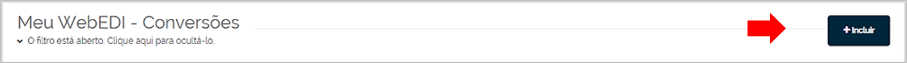
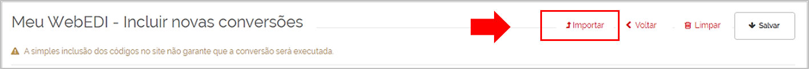
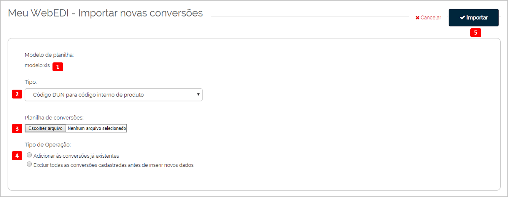

# Tabela de Conversões

_**Localização:** Menu Meu WebEDI, Submenu Tabela de Conversões_  
_**Módulos que esta tela atende:** EDI Mercantil, Logístico e Financeiro._  

Permite realizar a manutenção de códigos para a realização de de/paras. A simples inclusão dos códigos não garante a realização dos testes. Para maiores informações entre em contato a Neogrid.  

Na tela principal, os filtros de pesquisa permitem localizar os códigos cadastrados. A pesquisa pode ser realizada pelo Tipo da Conversão, Organização Mapeada (seu parceiro de negócio), Dado Convertido ou Dado Original.  

Após clicar sobre o botão **Pesquisar**, é apresentada a listagem das conversões. São habilitados mais botões na parte superior da tela que permitem exportar o resultado da pesquisa, visualizar o histórico e excluir uma conversão.  

O botão **Editar**, localizado após a última coluna, apresenta a tela que permite alterar as informações do registro selecionado na listagem, conforme imagem abaixo:  

**Cadastro Manual de Conversões**

O botão **Incluir**, localizado na parte superior da tela principal, apresenta a tela que permite adicionar quantos códigos forem necessários.  
       

Como proceder:  

+ Após o preenchimento dos campos, acione o botão **+Adicionar (1)** para incluir estes dados na **Lista de Conversões a Serem Adicionadas (2)**.  

+ Após adicionar todos os códigos, clique no botão **Salvar (3)** para gravar a lista de conversões.  
    

**Cadastro das Conversões por Importação**  

O botão **Importar**, localizado na parte superior da tela principal, apresenta a tela que permite efetuar a importação das conversões.  
  

Como proceder:  
  

+ Faça o download da planilha modelo, clicando sobre o link do texto **Modelo.xls (1)**.  

+ Após baixar o arquivo, preencha a planilha com os dados conforme seu cadastro.  

+ Finalizado o cadastro na planilha, selecione o **tipo de conversão (2)** e realize o upload do arquivo acionando o botão **Escolher arquivo (3)**.  

+ Após o upload, selecione o **tipo de operação (4)**: “adicionar as conversões já existentes” ou “excluir todas as conversões cadastradas antes de inserir novos dados”.  

+ Clique em **Importar (5)**.  

