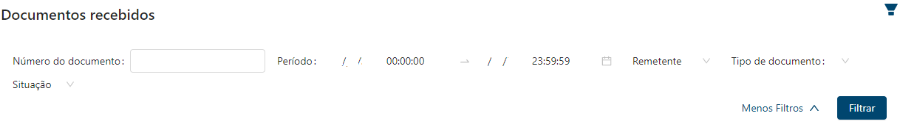
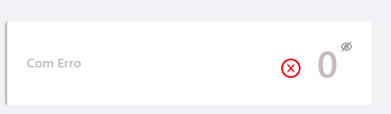
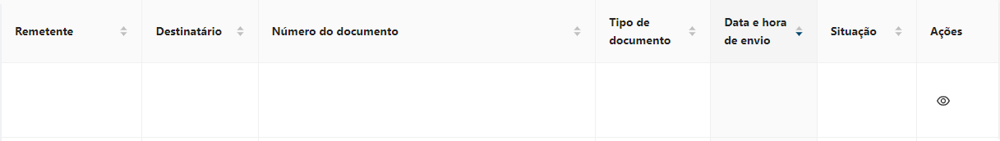
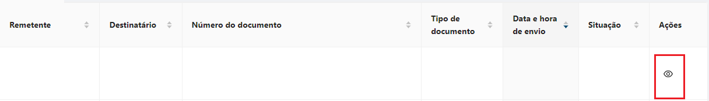
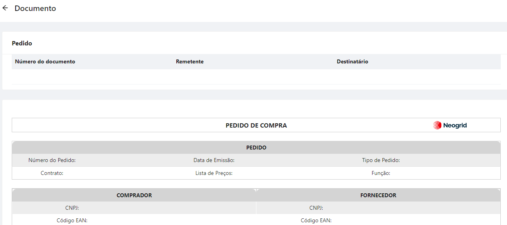
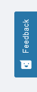
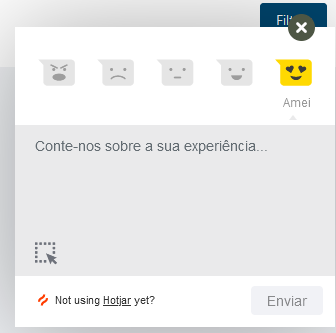

# Meus Documentos  

_**Localização:** Menu Meus Documentos > Documentos Recebidos_  
_**Módulos que as telas atendem:** EDI Mercantil, Logístico e Financeiro_  

**Meus Documentos > Aba Documentos Recebidos**  

Esta funcionalidade permite efetuar a consulta e gerar uma listagem dos documentos recebidos dos parceiros de negócio. 

Ao acessar a aba **Meus Documentos**, é apresentada a página de pesquisa, oferecendo opções de filtros para localizar as mensagens recebidas e gerar a listagem com os resultados. 

## Filtro de Pesquisa  

  

O Filtro de Pesquisa é composto pelos campos: 

+ **Número do documento:** Permite filtrar informando uma identificação do documento. Pode ser o número de um pedido, de uma NF-e ou de uma cobrança, desde que integrados na aplicação WebEDI. Também é possível informar apenas o número *parcial* do documento. Desta forma, serão listados todos os resultados que contenham a informação parcial preenchida no filtro.

+ **Período:** Permitem filtrar pelo período da recepção/processamento dos documentos na aplicação. Inclui a opção de informar data e hora.

+ **Situação:** Permite selecionar a situação/status de leitura de um documento (Lido ou Não Lido), bem como selecionar arquivos com status de Erro. 

+ **Remetente:** Permite filtrar informando o CNPJ ou Razão Social do Remetente dos documentos. 

+ **Tipo de documento:** Permite filtrar os documentos recebidos por tipo de documento (Exemplo: Pedido, Nota Fiscal, etc). Para utilizar este filtro, clique na opção **Mais Filtros**, localizada à direita ao lado do filtro **Remetente**. O filtro **Tipo de documento** será apresentado. Clique no ícone da lupa para selecionar o documento que deseja consultar.  

## Big Numbers  

 

Exibe os contadores existentes, que somam os documentos por status de leitura e com erros. A contagem exibida é baseada apenas no período selecionado nos filtros de pesquisa.

+ **Com Erro:** Quantifica os documentos encontrados com erro durante o período selecionado nos filtros.

## Listagem (Resultados da Pesquisa) 

Após preencher os filtros desejados, clique no botão **Filtrar**, para que os documentos correspondentes sejam listados.

 

As informações dos documentos pesquisados são listadas nas seguintes colunas:

+ **Remetente:** Exibe o nome do remetente do documento, razão social da empresa. 

+ **Destinatário:** Exibe o nome do destinatário do documento, razão social da empresa.

+ **Número do documento:** Exibe o número identificador do documento.

+ **Tipo de documento:** Exibe a descrição do tipo do documento (Exemplo: Pedido, Instrução de Transporte, Pagamento de Tributos).

+ **Data e hora de envio:** Exibe a data em que o documento foi recebido no WebEDI. Informa a data do primeiro evento registrado.

+ **Situação:** Exibe o status que indica se o destinatário já realizou a leitura do documento. A Leitura pode ser realizada via Portal (manualmente) ou através de conectividade (automaticamente). Exibe também aqueles documentos que tiveram algum erro no processamento.

+ **Ações:** Exibe a visualização do conteúdo do documento. Caso não haja template de visualização contratado, será exibida uma mensagem indicativa.

## **Visualizar documento** 

A visualização dos documentos pode ser realizada por meio do botão de ação **Visualizar documento**, disponível na coluna **Ações** da listagem de documentos. Veja a seguir:

 

Ao acionar o botão de ação **Visualizar documento** será exibido todo o conteúdo do documento, caso haja template de visualização contratado. 

Veja a seguir um exemplo de Pedido de Compra, visualizado por meio da aplicação:

 

A visualização do documento apresenta um **cabeçalho** com as seguintes informações:

+ **Número do Documento:** Exibe o número identificador do documento. 

+ **Remetente:** Exibe o nome do remetente do documento, razão social da empresa.

+ **Destinatário:** Exibe o nome do destinatário do documento, razão social da empresa.

::: red
#### Atenção

- Caso não tenha sido contratado um template de visualização, será exibida a mensagem *"Não existe visualização disponível para este documento"*. 
Para contratar um template de visualização entre em contato com vendas.is@neogrid.com

- Caso seja apresentada alguma divergência com o documento, como um erro de processamento impossibilitando a sua visualização, será exibida a seguinte mensagem *"Indisponível para visualização"*.

::: 

## Feedback

O Botão **Feedback** permite  descrever como tem sido a sua experiência durante a utilização do Produto.

 

Ao clicar no botão são exibidos os ícones com os sentimentos que representam a sua experiência, bem como um campo para adicionar um texto opcional, caso desejar fazer algum comentário.

 

**Leia também:**

+ FAQ - [**"Meus Documentos"**](../faq/faq_meus_docs.md)