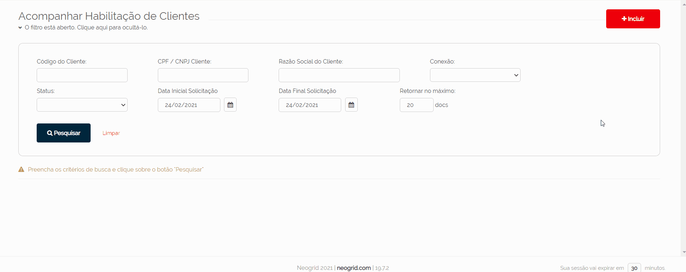
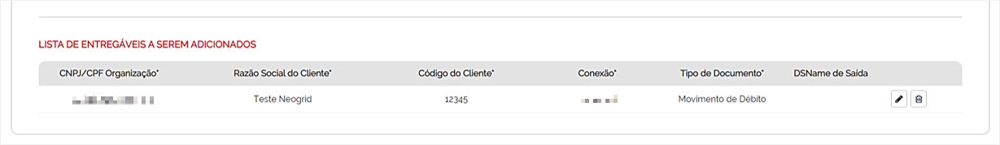
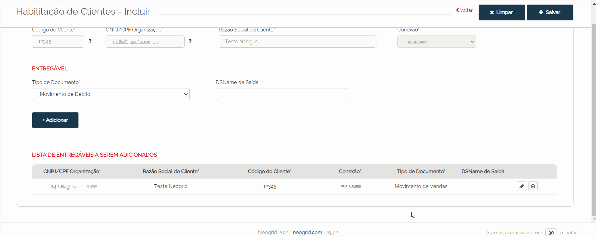

# Habilitação de Clientes - Incluir 

_**Localização:** Menu Solicitações, Submenu Habilitação de Cliente_  
_**Módulos que esta tela atende:** EDI Financeiro_  

Para acessar a tela **Habilitação de Clientes - Incluir**, clique sobre o botão **Incluir** localizado na tela [**Acompanhar Habilitação de Clientes**](../solic/parceiro.md).  

Esta tela permite ao parceiro de negócio criar a solicitação de conexão de seus novos clientes com o HUB.  

É possível incluir mais de um cliente na mesma solicitação da seguinte forma: o usuário cadastra os dados do novo cliente e armazena numa lista para que possa continuar cadastrando e acrescentando os demais. Ao salvar essa solicitação, os dados serão enviados para a base do EDI e uma notificação por e-mail é disparada para o HUB, para que este confira as solicitações e aprove as conexões. O parceiro de negócio poderá consultar o andamento das suas solicitações na tela [**Acompanhar Habilitação de Clientes**](../solic/parceiro.md).   

Vamos começar a solicitação? 

Preencha os campos abaixo com as informações do novo cliente:  
(_Campos obrigatórios para preenchimento*_)  

+ **Código do Cliente*** (informar o Ponto de Venda Matriz cadastrado no HUB)  
+ **CNPJ/CPF Organização*** (informar o CNPJ/CPF Matriz cadastrado no HUB) 
+ **Razão Social do Cliente***  
+ **Conexão*** (escolha o HUB em que será realizada a conexão)  
+ **Tipo de Documento*** (escolha o tipo de documento que será movimentado na conexão com o HUB)  
+ **DSName de Saída** (campo opcional onde pode ser informado o DSName de saída (nomenclatura) do documento do cliente que o HUB utilizará para tráfego de arquivos de **débito, financeiro e vendas**)  

Após o preenchimento dos campos, clique sobre o botão **Adicionar** para incluir as informações do cliente na lista da solicitação ([**Lista de Entregáveis a Serem Adicionados**](#lista-de-entregáveis-a-serem-adicionados)).  

Caso não tenha mais clientes para adicionar, clique sobre o botão **Salvar** para gravar a solicitação.  

**Exemplo de cadastro de solicitação:**  

  

::: yellow
#### Atenção!  
1 - O procedimento de **Salvar** é importante, pois além de gravar a solicitação, outras ações serão geradas automaticamente. São elas:  
+ Cadastro automático na base do Neogrid EDI, habilitando o tráfego de documentos do cliente do parceiro com o HUB;  
+ Envio de notificação para o HUB informando que existem novas solicitações para conferir e habilitar.  

2 - O botão **Limpar** quando acionado, irá remover os registros de todos os campos da tela, principalmente os registros acrescentados na tela "Lista de Entregáveis a Serem Adicionados".   
:::  

## Lista de Entregáveis a Serem Adicionados  

A lista de entregáveis da solicitação, apresenta a relação dos clientes adicionados durante o processo do cadastro.  

Acione o botão **Editar** para alterar os dados de um registro, ou acione o botão **Excluir** para remover da lista.  

**Exemplo de edição dos entregáveis:**  

  

