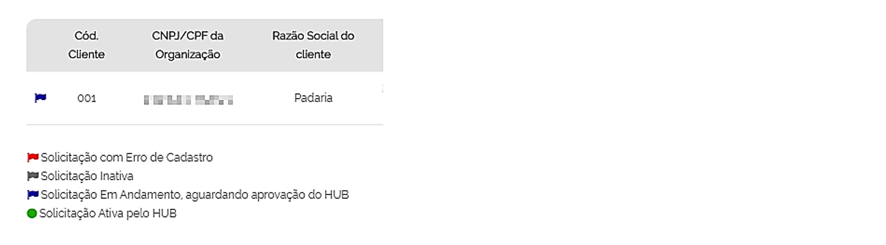
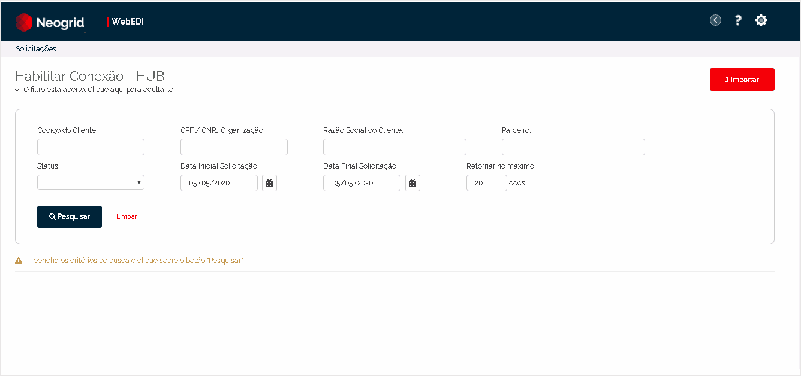
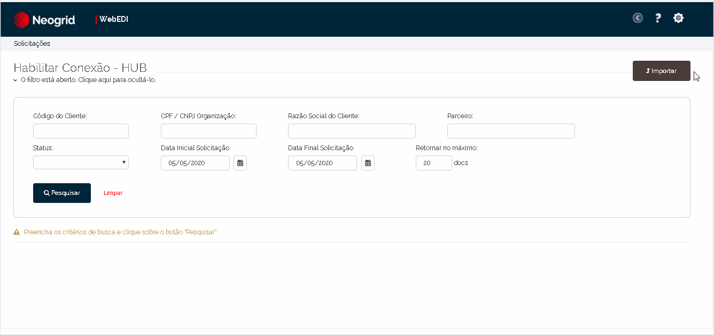

# Habilitar Conexão - HUB  

_**Localização:** Menu Solicitações, Submenu Habilitar Conexão_  
_**Módulos que esta tela atende:** EDI Financeiro_  

Esta tela permite ao HUB consultar as solicitações que estão pendentes para a ativação de novas conexões (clientes do parceiro). A ativação ou rejeição é realizada no relatório que é exibido após a consulta.   

Caso o HUB deseje agilizar o processo de ativação das novas conexões nessa tela, sem precisar executar a consulta e as habilitações manualmente, é só utilizar o botão **Importar** conforme explicado no tópico [**Importando Arquivo**](#importando-arquivo).  

Vamos começar?  

## Ativando Conexões Manualmente
### Consultando as solicitações  

Efetue a consulta utilizando os seguintes filtros:  

+ **Código do Cliente** (Ponto de Venda Matriz cadastrado no HUB)    
+ **CPF/CNPJ do Cliente** (CNPJ/CPF Matriz cadastrado no HUB)  
+ **Razão Social do Cliente**  
+ **Parceiro**  
+ **Status** (Situação da solicitação)  
+ **Data Inicial e Final da Solicitação**  

Informe a opção **Retornar no máximo** para determinar a quantidade máxima de documentos que deseja visualizar por página no relatório.  

Após o preenchimento dos filtros, clique sobre **Pesquisar**.  

O relatório exibe as seguintes informações:  

+ **Ícone de Status** (Esse ícone auxilia na identificação rápida da situação em que se encontra a solicitação no relatório. As legendas localizadas no final do relatório ajudam no entendimento sobre o que cada ícone significa.)  
    
+ **Código do Cliente** (Código de cadastro do cliente);  
+ **CNPJ/CPF da Organização**;
+ **Razão Social do Cliente**;  
+ **Parceiro** (Razão Social do Parceiro);  
+ **Data da Criação** (da solicitação);  
+ **Tipo de documento** (solicitado para tráfego);  
+ **DSName de Entrada** (Nomenclatura do documento que o HUB utilizará para tráfego de arquivos de **débito, financeiro e vendas**);  
+ **Status**, ou situação da solicitação, poderá apresentar as seguintes opções:  
   - **Em andamento:** indica que a solicitação (criada ou corrigida) está aguardando a habilitação pelo HUB.   
   - **Ativo:** indica que o HUB aceitou a solicitação e ativou a conexão do cliente em questão.  
   - **Inativo:** indica que o HUB rejeitou a solicitação do cliente em questão.  
   - **Erro de Cadastro:** indica que o HUB rejeitou a solicitação do cliente em questão por determinado erro de cadastro. O parceiro poderá corrigir essa solicitação (Tela [**Acompanhar Habilitação de Clientes**](../solic/parceiro.md)) para reenviar ao HUB.  
  

### Aprovando as conexões

Os ícones localizados após a coluna de **Status** permitem ativar as conexões solicitadas ou reprová-las informando o motivo. As opções são:  

+ **Ativar**: clique sobre esse ícone para habilitar a conexão.  

+ **Rejeitar**: ao clicar sobre esse ícone para reprovar a conexão, é apresentada a tela para informar o motivo da rejeição.  

**Exemplo da Habilitação Manual:**  

  

## Ativando Conexões por Importação

### Importando arquivo

É possível automatizar a operação de ativação das conexões, importando a planilha recebida por e-mail com as informações já consolidadas.  

Vamos começar?  

Clique sobre o botão **Importar** da tela inicial.  

Na tela seguinte (**Habilitação de Clientes - Importação**), escolha o arquivo salvo em seu computador e clique sobre o botão **Importar**.  

**Exemplo de importação do arquivo:**  

  
