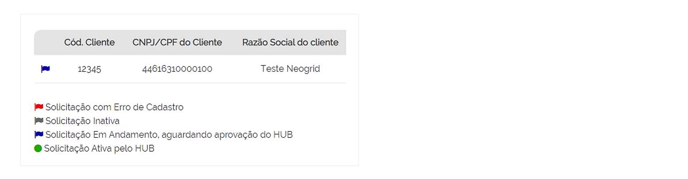
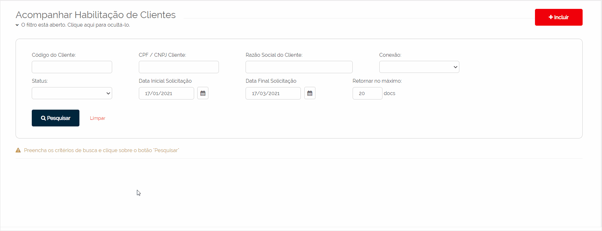

# Acompanhar Habilitação de Clientes  

_**Localização:** Menu Solicitações, Submenu Habilitação de Cliente_  
_**Módulos que esta tela atende:** EDI Financeiro_  

Esta tela permite ao parceiro de negócio consultar o andamento das solicitações de conexões de novos clientes, criadas na tela [**Habilitação de Clientes - Incluir**](../solic/cadastro.md).

Vamos começar?  

É possível filtrar por **Código** de cadastro, **CNPJ/CPF** e **Razão Social do Cliente**, **Conexão**, **Status** da solicitação e **Datas Inicial e Final** (período de criação da solicitação).  

Informe a opção **Retornar no máximo** para determinar a quantidade máxima de documentos que deseja visualizar por página no relatório.   

Após o preenchimento dos filtros, clique sobre **Pesquisar**.  

O relatório exibe as seguintes informações:   

+ **Ícone de Status** (Esse ícone auxilia na identificação rápida da situação em que se encontra a solicitação no relatório. As legendas localizadas no final do relatório ajudam no entendimento sobre o que cada ícone significa.)  

+ **Código do Cliente** (Código de cadastro do cliente);  
+ **CNPJ/CPF do Cliente**;
+ **Razão Social do Cliente**;  
+ **Conexão** (Nome do HUB em que foi requerida a conexão)  
+ **Data da Criação** da solicitação;  
+ **Tipo do documento** solicitado para tráfego;  
+ **DSName de Entrada e de Saída** (Nomenclatura do documento do cliente que o HUB utilizará para tráfego de arquivos de **débito, financeiro e vendas**)  
+ **Status**, ou situação da solicitação, poderá apresentar as seguintes opções:  
   - **Em andamento:** indica que a solicitação (criada ou corrigida) está aguardando a habilitação pelo HUB.   
   - **Ativo:** indica que o HUB aceitou a solicitação e ativou a conexão do cliente em questão.  
   - **Inativo:** indica que o HUB rejeitou a solicitação do cliente em questão.  
   - **Erro de Cadastro:** indica que o HUB rejeitou a solicitação do cliente em questão por determinado erro de cadastro. O parceiro poderá corrigir essa solicitação (botão **Editar**) para reenviar ao HUB.  
  
Os ícones localizados após a coluna de **Status** fornecem as seguintes ações:  

+ **Editar**: permite alterar o cadastro da solicitação em questão quando o **Status** estiver como **Erro de Cadastro**.  

+ **Motivo de Rejeição**: habilita uma nova linha para exibir o motivo de rejeição descrito pelo HUB na tela [**Habilitar Conexão - HUB**.](../solic/hub.md)  

+ **Remover**: exclui a solicitação do cliente em questão.  

**Exemplo da tela de acompanhamento:**  

  