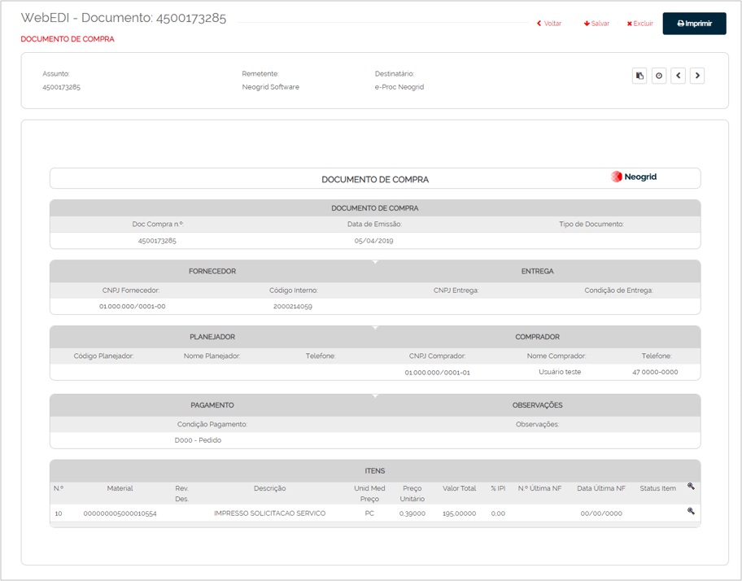
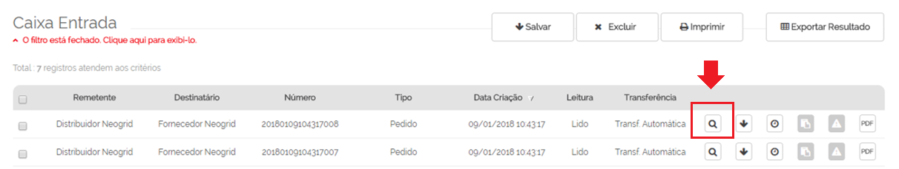
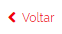
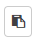
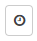
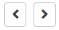

# Visualizando Documentos  

_**Localização:** Menu Caixa de Entrada e Caixa de Saída_  
_**Módulos que esta tela atende:** EDI Mercantil, Logístico e Financeiro_  

A partir da Caixa de Entrada e Caixa de Saída, o usuário poderá consultar os documentos que foram trafegados na aplicação WebEDI. Cada tipo de documento, possui um layout específico de visualização. Veja a seguir um exemplo de Documento de Compra visualizado através da aplicação:  

  

Para visualizar o documento, clique no botão de visualização (Lupa) localizado após a coluna **Transferência** da tela da listagem.  

  

Ações disponíveis ao visualizar um documento:  

|                     Ícone                     | Descrição                                                |
|:---------------------------------------------:|----------------------------------------------------------|
|  | Retorna para a lista de pesquisa                         |
|         | Exclui o documento da Caixa de Entrada ou Caixa de Saída |
|      | Gera versão para impressão                               |
|       | Exibe os documentos relacionados ao documento listado    |
|     | Exibe o histórico de transmissão do documento            |
|       | Permite navegar entre os documentos listados             |
