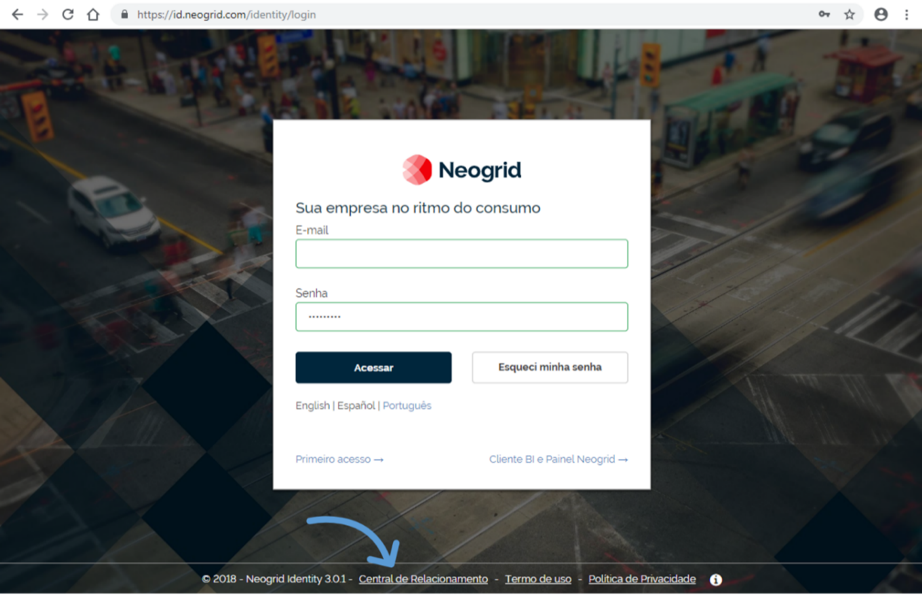
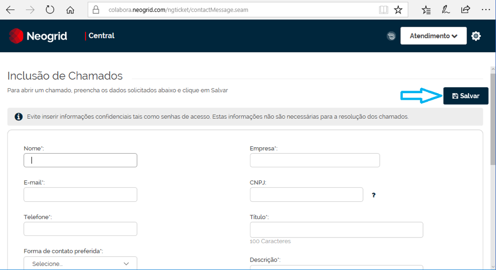
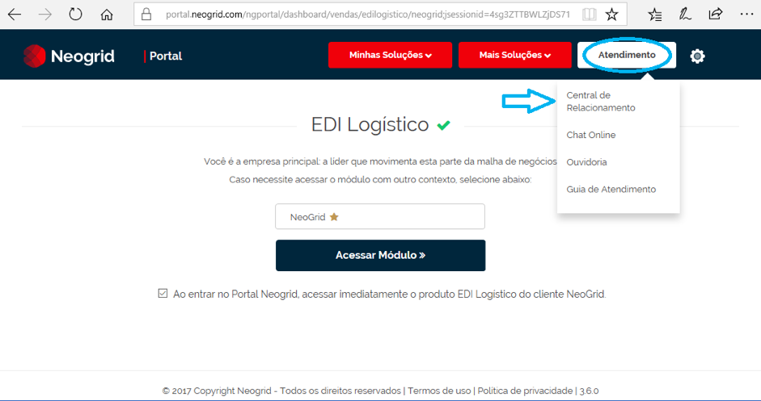
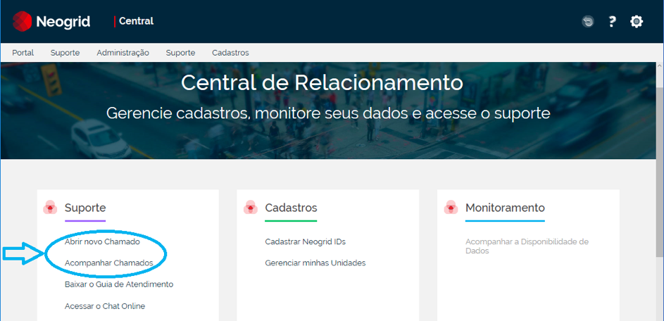
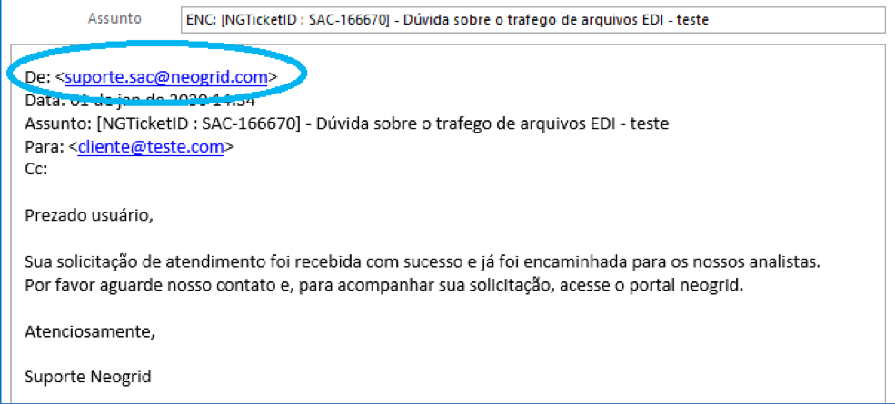
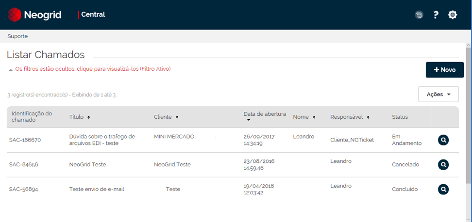

# Suporte Portal Neogrid  

O Portal que tem o objetivo de centralizar o acesso dos clientes às soluções Neogrid, também permite a abertura e acompanhamento de chamados de suporte por meio da opção “Central de Relacionamento”. Após aberto o chamado, a movimentação também ocorrerá via e-mail.  

## Principais objetivos com a Central de Relacionamento  

+ Abrir chamados para o suporte.  

+ Acompanhar o andamento do chamado.  

+ Retornar comentários ao suporte (no portal ou ao responder o e-mail do chamado).  
  
+ Ter visibilidade dos atendimentos realizados e dados históricos.  

## Como usar o portal  

1. Acesse o Portal Neogrid pelo link portal.neogrid.com e informe o seu e-mail e senha. Caso não possua, veja o passo 2.  

     

2. **Se deslogado:** Caso não tenha login (e-mail) e senha cadastrados, ainda pode ser aberto um chamado clicando em Central de Relacionamento conforme destacado acima.
Será aberto o formulário para inclusão do chamado e, após registrar sua solicitação, será retornado um e-mail de confirmação e registrado um chamado ao suporte Neogrid.  

     

::: yellow
#### Atenção!
Ao abrir um chamado, sempre informe a solução/produto da Neogrid que está utilizando. Isto irá agilizar a triagem do chamado, assim como seu tempo de resposta.
:::  

3. **Se logado, vá em Atendimento: Central de Relacionamento**  

     

   Na **Central de Relacionamento** você poderá:  incluir um novo chamado, acompanhar seus chamados, acessar o guia de atendimento e acessar o chat on-line, conforme imagem abaixo.  

     

::: blue
#### Nota!
Os outros itens da central dependem da solução contratada e estão sendo liberados gradativamente.  
:::  

4. **Recebimento do e-mail:** No momento em que o sistema recebe o chamado, um e-mail automático é disparado, conforme o exemplo abaixo:  

     

::: blue
#### Nota!
Recomendamos verificar se este endereço (suporte.sac@neogrid.com), está liberado em seu servidor de e-mails (spam) e não editar o assunto do e-mail para uma correta integração.  
:::  

5. **Para responder a solicitação do analista há duas opões:** Logar no sistema e adicionar um novo comentário clicando na lupa a direta na tela de resposta, conforme imagem abaixo, ou conforme item 4, respondendo o e-mail recebido.  

     

::: red
#### Importante!
A opção de responder e-mail só está habilitada para atualizar chamados já existentes – não é possível abrir chamados por e-mail.  
:::  
